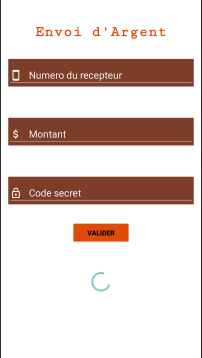
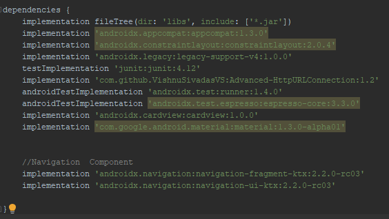

# Application Mobile de Simulation de Paiement en Ligne (PayAll)
<p align="center">
 </div>
</p>

PayAll est une application mobile permettant de faire toutes les opérations nécessaire sur un compte bancaire: transfert d'argent, retrait, depot, consultation du compte.

<p align="center">
 </div>
</p>

## TECHNOLOGIES UTILISEES

* Core Java
* SDK version 30
* MySQL
* PHP (pour ecrire tous les scripts qui effectuent toutes les opérations dans la base de données)
* XAMP (pour heberger les scripts php)

# Guide de déploiement
Pour plus d'informations contactez Tamaroas Dev sur facebook ou envoyez moi un Mail (<b>martialkom123@gmail.com</b>)

## Dépendances
<p align="center">
 </div>
</p>

## Connexion avec la base de données grace aux scripts PHP

* Envoi d'une requette HTTP vers l'application web 
```java
            try {
                Handler handler = new Handler(Looper.getMainLooper());
                handler.post(new Runnable() {
                    @Override
                    public void run() {
                        
                        //Starting Write and Read data with URL
                        //Creating array for parameters
                        String[] field = new String[2];
                        field[0] = "numtel";
                        field[1] = "code";


                        //Creating array for data
                        String[] data = new String[2];
                        data[0] = "" + number.getText().toString();
                        data[1] = "" + code.getText();

                        PutData putData = new PutData("http://infoscampus.com/loginRegister/consulterSolde.php", "POST", field, data);
                        if (putData.startPut()) {
                            if (putData.onComplete()) {
                                String result = putData.getResult();
                                if (!result.equals("Mauvais code"))
                                    solde.setText(result);

                                else code.setError("Mauvais code secret");
                            }
                        }
                    }
                });
            }catch(Exception e){
                Toast.makeText(this, "Une erreur est survenue", Toast.LENGTH_SHORT).show();
                return;
            }

```

* Script PHP hébergé
```php
<?php
require "DataBase.php";
$db = new DataBase();
if (isset($_POST['numtel']) && isset($_POST['code']) ) {
    if ($db->dbConnect()) {
      $db->consulterSolde("user",$_POST['numtel'], $_POST['code']);
       
    } else echo "Error: Database connection";
} else echo "All fields are required";
?>
```
## Paramètres de la base de données

* Créer la base de donnée PayAll
* inserer la table utilisateur

```sql
CREATE TABLE `user` (
  `id` int(11) NOT NULL,
  `nom` text NOT NULL,
  `prenom` text NOT NULL,
  `date_naissance` text NOT NULL,
  `num_cni` text NOT NULL,
  `tel` int(11) NOT NULL,
  `mdp` text NOT NULL,
  `solde` int(11) NOT NULL DEFAULT 0,
  `profil` varchar(255) NOT NULL
) ENGINE=InnoDB DEFAULT CHARSET=utf8mb4;
```
* Configuration de la connexion à la base de données (loginRegister/DataBaseConfig.php)
```php
<?php

class DataBaseConfig
{
    public $servername;
    public $username;
    public $password;
    public $databasename;

    public function __construct()
    {

        $this->servername = 'localhost';
        $this->username = 'root';
        $this->password = '';
        $this->databasename = 'payall';

    }
}

?>
```

